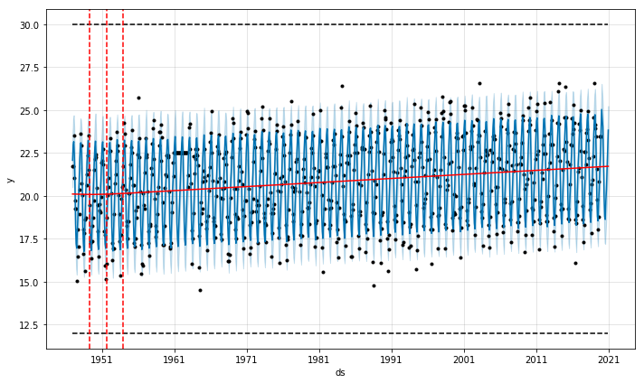
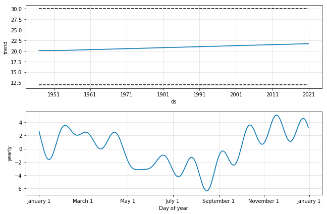
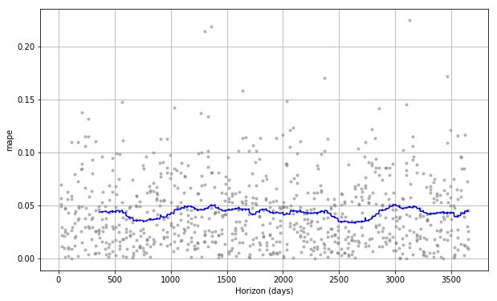
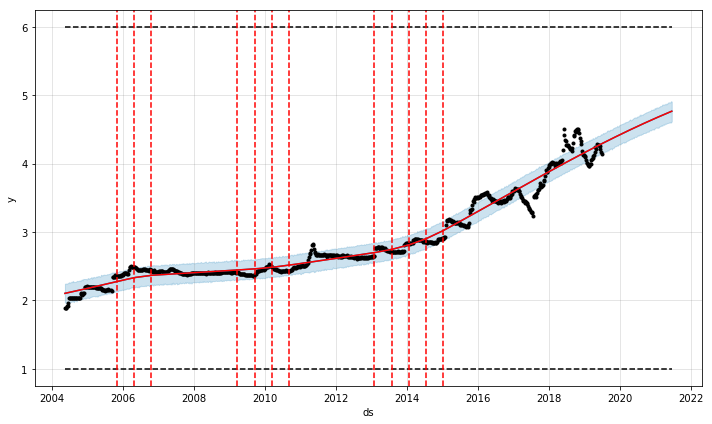
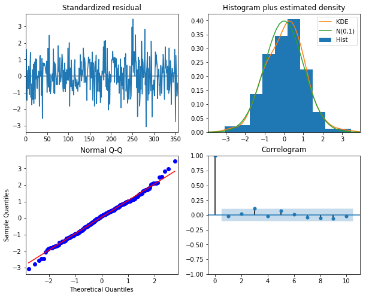
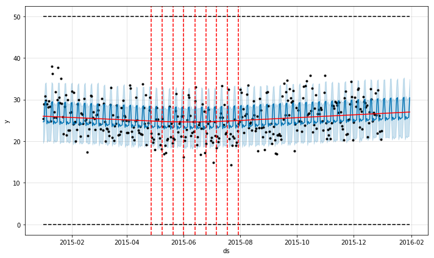

# Notes on time series forecasting

- Forecasting: Principles and Practice - Rob J Hyndman and George Athanasopoulos [[open notes]](hyndman-forecast-book/hyndman-forecast-book.md)

# Example forecast applications

## Temperature forecast for some Brazilian cities 

[Open jupyter notebook [ipynb]](./notebooks/temperature-sp.ipynb)

## Gas Prices in Brazil 

[Open jupyter notebook [ipynb]](./notebooks/gas-prices-brazil.ipynb)

## Beer consumption São Paulo 

[Open jupyter notebook [ipynb]](./notebooks/beer-consumption-sp.ipynb)

