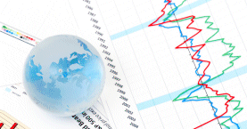

# Statistical forecasting: notes on regression and time series analysis
Authors: Robert Nau



[Available here](https://people.duke.edu/~rnau/411home.htm)
> "This web site contains notes and materials for an advanced elective course on statistical forecasting that is taught at the Fuqua School of Business, Duke University. It covers linear regression and time series forecasting models as well as general principles of thoughtful data analysis."

# Table of Contents
- [Statistical forecasting: notes on regression and time series analysis](#statistical-forecasting-notes-on-regression-and-time-series-analysis)
- [Table of Contents](#table-of-contents)
- [1. Get to know your data](#1-get-to-know-your-data)
  - [Principles and risks of forecasting](#principles-and-risks-of-forecasting)
    - [Signal vs. noise](#signal-vs-noise)
    - [Risks of forecasting](#risks-of-forecasting)
  - [Get to know your data](#get-to-know-your-data)
    - [PLOT THE DATA!](#plot-the-data)
  - [Inflation adjustment ("deflation")](#inflation-adjustment-%22deflation%22)
  - [Seasonal adjustment](#seasonal-adjustment)
    - [Multiplicative adjustment](#multiplicative-adjustment)
    - [Additive adjustment](#additive-adjustment)
    - [Acronyms](#acronyms)
  - [Stationarity and differencing](#stationarity-and-differencing)
    - [Statistical stationarity](#statistical-stationarity)
    - [First-difference](#first-difference)
  - [The logarithm transformation](#the-logarithm-transformation)
    - [Change in natural log ≈ percentage change](#change-in-natural-log-%e2%89%88-percentage-change)
    - [Linearization of exponential growth and inflation](#linearization-of-exponential-growth-and-inflation)
    - [Trend measured in natural-log units ≈ percentage growth](#trend-measured-in-natural-log-units-%e2%89%88-percentage-growth)
    - [Errors measured in natural-log units ≈ percentage errors](#errors-measured-in-natural-log-units-%e2%89%88-percentage-errors)
    - [Coefficients in log-log regressions ≈ proportional percentage changes](#coefficients-in-log-log-regressions-%e2%89%88-proportional-percentage-changes)
- [2. Introduction to forecasting: the simplest models](#2-introduction-to-forecasting-the-simplest-models)
  - [Review of basic statistics and the simplest forecasting model: the sample mean](#review-of-basic-statistics-and-the-simplest-forecasting-model-the-sample-mean)
      - [Why *squared* error?](#why-squared-error)
      - [Fundamental law of forecasting risk](#fundamental-law-of-forecasting-risk)
  - [Notes on the random walk model](#notes-on-the-random-walk-model)
    - [The geometric random walk model](#the-geometric-random-walk-model)
    - [Reasons for using the random walk model](#reasons-for-using-the-random-walk-model)
  - [Mean (constant) model](#mean-constant-model)
  - [Linear trend model](#linear-trend-model)
  - [Random walk model](#random-walk-model)
  - [Geometric random walk model](#geometric-random-walk-model)
    - [More general random walk forecasting models](#more-general-random-walk-forecasting-models)
  - [Three types of forecasts: estimation, validation, and the future](#three-types-of-forecasts-estimation-validation-and-the-future)
- [3. Averaging and smoothing models](#3-averaging-and-smoothing-models)
  - [Simple moving averages](#simple-moving-averages)
  - [Comparing measures of forecast error between models](#comparing-measures-of-forecast-error-between-models)
  - [Simple exponential smoothing](#simple-exponential-smoothing)
- [4. Linear regression models](#4-linear-regression-models)
- [5. ARIMA models for time series forecasting](#5-arima-models-for-time-series-forecasting)
- [6. Choosing the right forecasting model](#6-choosing-the-right-forecasting-model)

> "I have seen the future and it is very much like the present, only longer." 
> -- Kehlog Albran, *The Profit*

# 1. Get to know your data
## Principles and risks of forecasting
Statistical forecasting: art and science of forecasting from data, with or without knowing in advance what equation you should use

### Signal vs. noise
Variable you want to predict = signal + noise
- Signal: predictable component
- Noise: what is left over

Sensitive statistical tests are needed to get a better idea of whether the pattern you see in the data is really random or whether there is some signal yet to be extracted. If you fail to detect a signal that is really there, or falsely detect a signal that isn’t really there, your forecasts will be at best suboptimal and at worst dangerously misleading

**random walk model**: the variable takes random steps up and down as it goes forward:
- if you transform by taking the period-to-period changes (the "first difference") it becomes a time series that is described by the mean model
- the confidence limits for the forecasts gets wider at longer forecast horizons
- typical of random walk patterns -> they don't look random as they are! -> analyze the statistical properties: momentum, mean-reversion, seasonality

### Risks of forecasting
> "If you live by the crystal ball you end up eating broken glass"

- **Intrinsic risk**: random variation beyond explanation with the data and tools available
- **Parameter risk**: errors in estimating the parameters of the forecasting model, under the assumption that you are fitting the correct model to the data in the first place
> When predicting time series, more sample data is not always better -> might include older data that is not as representative of current conditions. **Blur of history** problem: no pattern really stays the same forever

You can't eliminate instrinsic risk and parameter risk, *you can and should try to quantify* them in relative terms -> so the appropriate risk-return tradeoffs can be made when decisions are based on the forecast

- **Model risk**: risk of choosing the wrong model. *Most serious form of forecast error* -> can be reduced by following good statistical practices: Follow good practices for exploring the data, understand the assumptions that are behind the models and test the assumptions.

If the errors are not pure noise -> there is some pattern in them, and you could make them smaller by adjusting the model to explain that pattern

## Get to know your data
- Where did it come from?
- Where has it been?
- Is it clean or dirty?
- In what units is it measured?

> Assembling, cleaning, adjusting and documenting the units of the data is often the most tedious step of forecasting

### PLOT THE DATA!
You should graph your data to get a feel for its qualitative properties -> your model must accommodate these features and ideally it should shed light on their underlying causes

## Inflation adjustment ("deflation")
Accomplished by dividing a monetary time series by a price index, such as the Consumer Price Index (CPI) -> uncover the real growth
- original series: "nominal dollars" or "current dollars"
- deflated series: "constant dollars"

> Not always necessary, sometimes forecasting the nominal data or log transforming for stabilizing the variance is simpler

Inflation adjustment is only appropriated for money series. If a non-monetary series shows signs of exponential growth or increasing variance -> try a logarithm transformation

## Seasonal adjustment
### Multiplicative adjustment
Increasing amplitude of seasonal variations is suggestive of a multiplicative seasonal pattern -> can be removed by **multiplicative seasonal adjustment**: dividing each value of the time series by a seasonal index that is representative of normal typically observed in that season

### Additive adjustment
For time series whose seasonal variations are roughly constant in magnitude, independent of the current average level of the series -> adding or subtracting a quantity that represents the absolute amount by which the value in that season of the year tends to be below or above normal, as estimated from past data

> Additive seasonal patterns are somewhat rare, but if applying log transform -> you should use additive rather than multiplicative

### Acronyms
- **SA**: seasonally adjusted
- **NSA**: not seasonally adjusted
- **SAAR**: seasonally adjusted annual rate -> each period's value has been adjusted for seasonality and then multiplied by the number of periods in a year, as though the same value had been obtained in every period for a whole year

## Stationarity and differencing
### Statistical stationarity
A stationary time series is one whose statistical properties such as mean, variance, autocorrelation, etc. are all constant over time. Most statistical forecasting methods are based on the assumption that the time series can be rendered approximately stationary (i.e., "stationarized") through the use of mathematical transformations

- **trend-stationary**: series has a stable long-run rend and tends to revert to the trend line following a disturbance -> to stationarize it = detrending
- **difference-stationary**: if the mean, variance, and autocorrelations of the original series are not constant in time, even after detrending, perhaps the statistics of the changes in the series between periods or between seasons will be constant

> **Unit root test**: to understand if a series is trend-stationary or difference-stationary

### First-difference
Series of changes from one period to the next
- **random walk model**: if first-difference of a series is stationary and also completely random (not autocorrelated)
- **ETS or ARIMA**: can be used when the first-difference of a series is stationary but not completely random (its value at period t is autocorrelated with its value at earlier periods)

## The logarithm transformation
### Change in natural log ≈ percentage change
**Small** changes in the natural log of a variable are directly interpretable as percentage changes to a very close approximation

### Linearization of exponential growth and inflation
The log transformation converts the exponential growth pattern to a linear growth pattern, and it simultaneously converts the multiplicative (proportional-variance) seasonal pattern to an additive (constant-variance) seasonal pattern

> Logging a series often has an effect very similar to deflating: it straightens out exponential growth patterns and reduces heteroscedasticity (i.e., stabilizes variance). Logging is therefore a "poor man's deflator" which does not require any external data

**Geometric random walk**: logging the data before fitting a random walk model -> commonly used for stock price data

### Trend measured in natural-log units ≈ percentage growth
Usually the trend is estimated more precisely by fitting a statistical model that explicitly includes a local or global trend parameter, such as a linear trend or random-walk-with-drift or linear exponential smoothing model.  When a model of this kind is fitted in conjunction with a log transformation, its trend parameter can be interpreted as a percentage growth rate.

### Errors measured in natural-log units ≈ percentage errors
If you look at the error statistics in logged units, you can interpret them as percentages if they are not too large -- if the standard deviation is 0.1 or less

### Coefficients in log-log regressions ≈ proportional percentage changes
In many economic situations (particularly price-demand relationships), the marginal effect of one variable on the expected value of another is linear in terms of percentage changes rather than absolute changes

# 2. Introduction to forecasting: the simplest models
## Review of basic statistics and the simplest forecasting model: the sample mean
Historical sample mean (or constant model, or intercept-only regression): if the series consists of i.i.d. values, the sample mean should be the next value if the goal is to minimize MSE

#### Why *squared* error?
- the central value around which the um of squared deviations are minimized is the sample mean
- variances are additive when random variables that are statistically independent are added together
- large errors often have disproportionately worse consequences than small errors, hence the squared error is more representative of the economic consequences of error
- variances and covariances play a key rola in normal distribution theory and regression analysis

> nonlinear transformations of the data (e.g., log or power transformations) can often be used to turn skewed distributions into symmetric (ideally normal) ones, allowing such data to be well fitted by models that focus on mean values.

#### Fundamental law of forecasting risk
```
Variance of forecasting risk = 
variance of intrinsic risk + 
variance of parameter risk
```

Confidence intervals: sort like a probability, but not exactly -> there's an x% probability that your future data will fall in your x% confidence interval for the forecast

```
Confidence interval = 
forecast ± 
(critical t-value) × (standard error of forecast)
```

95% confidence interval is (roughly) the forecat "plus-or-minus two standard errors"

> A rule of thumb: when adjusted R-squared is fairly small (say, less than 20%), the percentage by which the standard error of the regression model is less than the standard error of the mean model is roughly one-half of adjusted R-squared.

t-stats, P-values, and R-squared, and other test statistics are numbers you should know how to interpret and use, but they are not the most important numbers in your analysis and they are not the bottom line:
- what new things have you learned from your data?
- what assumptions does your model make?
- would these assumptions make sense to someone else?
- would a simpler model perform almost as well?
- how accurate are your model's predictions?
- how accurate it is likely to be to predict the future?
- how good are the inferences and decisions?

## Notes on the random walk model
Model assumes that *in each period the variable takes a random step away from its previous value, and the steps are independently and identically distributed in size (“i.i.d.”)*. This is equivalent to saying that the first difference of the variable is a series to which the mean model should be applied.

> if you begin with a series that wanders all over the map, the first difference looks i.i.d. sequence -> random walk model is a potentially good candidate

- without drift: all future values will equal the last observed value 
- with drift: the average increase from one period to the next (estimated drift = slope = d)

> **Square root of time rule**: The confidence interval for a k-period-ahead random walk forecast is wider than that of a 1-period-ahead forecast by a factor of square-root-of-k

Are the daily changes statistically independent as well having a mean of zero? autocorrelation plot -> **random walk without drift**

### The geometric random walk model
The natural logarithm of the variable is assumed to walk a random walk, usually with drift

Diff-logs are interpretable as (approximate) percentage changes

> it is very hard to estimate the trend in a random-walk-with-drift model based on the mean growth that was observed in the sample of data unless the sample size is very large

Fitting a random-walk-with-drift model to the logged series is equivalent to fitting the geometric random walk model to the original series. 

### Reasons for using the random walk model
- If you see what looks like pure noise (i.i.d. variations) after performing a 1st -difference or diff-log transformation, then your data is telling you that you that it is a random walk. This isn’t very exciting in terms of the point forecasts you should make (“next month will be the same as last month, plus average growth”), but it has very important implications in terms of how much uncertainty there is in forecasting more than one period ahead.
- benchmark against which to compare more complicated time series models, particularly regression models

## Mean (constant) model
Predicting a variable whose values are i.i.d.

**Sample mean**: by definition an unbiased predictor and minimizes the mean squared forecasting error regardless of the probability distribution -> it is the value around which the sum of squared deviations of the sample data is minimized

*Standard error of the mean*: how accurate is the estimate of the sample mean -> equals the sample stdev divided by the sqrt of the sample size

Central limit theorem -> large samples: 95% confidence interval = mean +- 2*stdev

*Standard error of the forecast*: equal to the sample stdev * sqrt(1+1/n)

Confidence interval for a forecast is the point forecast plus-or-minus the appropriate critical t-value times the standard error of the forecast

> The critical t-value for a 50% confidence interval is approximately 2/3, so a 50% confidence interval is one-third the width of a 95% confidence interval. The nice thing about a 50% confidence interval is that it is a **"coin flip"** as to whether the true value will fall inside or outside of it, which is extremely easy to think about

If we can find some mathematical transformation (e.g., differencing, logging, deflating, etc.) that converts the original time series into a sequence of values that are i.i.d., we can use the mean model to obtain forecasts and confidence limits for the transformed series, and then reverse the transformation to obtain corresponding forecasts and confidence limits for the original series.

## Linear trend model
aka trend-line model: special case of a simple regression model in which the independent variable is just a time index variable.

> R-squared = 0.143 -> the variance of the regression model's errors is 14.3% less than the variance of the mean model's errors, i.e., the model has "explained" 14.3% of the variance in the series

If the model has succeeded in extracting all the "signal" from the data, there should be no pattern at all in the errors: the error in the next period should not be correlated with any previous errors:
- **lag-1 autocorrelation**: should be very close to zero
- **Durbin-Watson statistic**: ought to be very close to 2

> trend lines have their use as visual aids, but are often poor for forecasting

## Random walk model
Time series with irregular growth -> predict the change from one period to the next (first difference)

**autocorrelation at lag k** -> correlation between the variable and itself lagged by k periods

- **random-walk-without-drift**: assumes that at each point, the series merely takes a random step away from its last recorded position, with steps whose mean value is zero -> values of the autocorrelations are not significantly different than zero (95% confidence interval), no change from one period to the next, because past data provides no information about the direction of future movements
- **random-walk-with-drift**: mean step size is some nonzero value

In the random-walk-without-drift model, the standard error of the 1-step ahead forecast is the root-mean-squared-value of the period-to-period changes

For a random-walk-with-drift, the forecast standard error is the sample standard deviation of the period-to-period changes.

"Square root of time" rule for the errors of random walk forecasts: the standard error of a k-step-ahead forecast is larger than that of the 1-step-ahead forecast by a factor of square-root-of-k. This explains the sideways-parabola shape of the confidence bands for long-term forecasts.

> Random walk may look trivial -> naive model (always predict that tomorrow will be the same as today). The square-root-of-time pattern in its confidence bands for long-term forecasts is of profound importance in finance (it is the basis of the theory of options pricing), and the random walk model often provides a good benchmark against which to judge the performance of more complicated models

RWM -> special case of an ARIMA model -> ARIMA(0, 1, 0)

## Geometric random walk model
Natural logarithm transformation: linearize exponential growth and stabilize variance of changes ("diff-log")

> It can be dangerous to estimate the average rate of return to be expected in the future (let alone anticipate short-term changes in direction), by fitting straight lines to finite samples of data!

**Geometric random walk model**:  Application of the random walk model to the logged series implies that the forecast for the next month's value of the original series will equal the previous month's value plus a constant percentage increase.

In unlogged units, the 95% confidence limits for long-term forecasts are noticeably asymmetric

### More general random walk forecasting models
- RW model 1: basic geometric random walk -> assumes series in different periods are statistically independent (uncorrelated) and also identically distributed
- RW model 2: assumes the series in different periods are statistically independent but not identically distributed
- RW model 3: assumes that returns in different periods are uncorrelated but not otherwise independent. The **ARCH** (autoregressive conditional heteroscedasticity) and **GARCH** (generalized ARCH) models assume that the local volatility follows an autoregressive process, which is characterized by sudden jumps in volatility with a slow reversion to an average volatility

## Three types of forecasts: estimation, validation, and the future
**Out-of-sample validation**: withhold some of the sample data from the model identification and estimation process, then use the model to make predictions for the hold-out data to see how accurate they are and to determine whether the statistics of their errors are similar to those that the model made within the sample of data that was fitted

Overfitting (likely when):
- model with a large number of parameters fitted to a small sample of data
- model has been selected from a large set of potential models precisely by minimizing the MSE in the estimation period

Backtests: one-step-ahead forecasts in the validation period (held out during parameter estimation)

> If you test a great number of models and choose the model whose errors are smallest in the validation period, you may end up overfitting the data within the validation period as well as in the estimation period

- **Holding data out for validation purposes** is probably the single most important diagnostic test of a model: it gives the best indication of the accuracy that can be expected when forecasting the future
- When you're ready to forecast the future in real time, you should of course use all the available data for estimation, so that the most recent data is used

Forecasts into the future are "true" forecasts that are made for time periods beyond the end of the available data

The model with the tightest confidence intervals is not always the best model -> a bad model not always know it is a bad model

# 3. Averaging and smoothing models
## Simple moving averages
- mean model: best predictor of tomorrow is the avg of everything that has happened until now
- random walk model: best predictor of tomorrow is what happened today, ignoring previous history
- moving average: take an average of what has happened in some window of the recent past

**moving average model**: superior to the mean model in adapting to cyclical pattern and superior to the random walk model in not being too sensitive to random shocks from one period to the next

Simple moving average (SMA):
- Each of the past m observations gets a weight of `1/m` in the averaging formula, so as `m` gets larger, each individual observation in the recent past receives less weight. This implies that larger values of `m` will filter out more of the period-to-period noise and yield *smoother-looking* series of forecasts
- average age of the data in the forecast is `(m+1)/2` -> amount by which the forecasts will tend to lag behind in trying to follow trends or respond to turning points

> Value of `m` tradeoff: filtering out more noise vs. being too slow to respond to trends and turning points

## Comparing measures of forecast error between models
- **RMSE**: root mean squared error: (the most common standard of goodness-of-fit, penalizes big errors relatively more than small errors because it squares them first; it is approximately the standard deviation of the errors if the mean error is close to zero)
- **MAE**: mean absolute error (the average of the absolute values of the errors, more tolerant of the occasional big error because errors are not squared)
- **MAPE**: mean absolute percentage error (perhaps better to focus on if the data varies over a wide range due to compound growth or inflation or seasonality, in which case you may be more concerned about measuring errors in percentage terms)
- **ME**: mean error (this indicates whether forecasts are biased high or low—should be close to 0)
- **MPE**: mean percentage error (ditto in percentage terms)

Best measure for size of error = RMSE

Easier for non-specialists to understand = MAE and MAPE

`SMA with a trend = SMD + drift` (add a constant to the SMA forecasting equation)

`Tapered Moving Average`: put only half as much weight on the newest and oldest values -> more robust to outliers in the data

## Simple exponential smoothing
SMA problems:
- putting equal weight on the last m observations and no weight on any previous observations is usually not the best way to average values that are arriving consecutively in time
- would make more sense to gradually decrease the weights placed on the older values
- its confidence intervals for long-horizon forecasts do not widen at all

**Simple exponential smoothing (SES) aka Exponentially weighted moving average model**: addresses these shortcomings of SMA

most used time series model in business applications:
- good forecast under a wide range of conditions
- computationally it is extremely simple

> the SES model is an interpolation between the mean model and the random walk model with respect to the way it responds to new data. As such it might be expected to do better than either of them in situations where the random walk model over-responds and the mean model under-responds, and indeed it does

Overall the SES model is superior to the SMA model in responding a bit more quickly to the newest data while treating older data more even-handedly, when the models otherwise yield the same average age

> all models are based on assumptions about how the world works, and you need to understand what the assumptions are and (ideally) you should believe in the assumptions of your chosen model and be able to explain and defend them. 


# 4. Linear regression models

# 5. ARIMA models for time series forecasting

# 6. Choosing the right forecasting model
